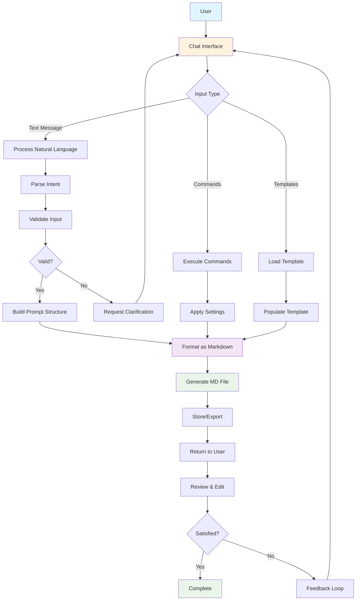

# Diagrams for Prompt Builder

This document describes the Mermaid diagrams created to visualize the chat UI system that produces markdown files.

## Diagrams Included

### 1. chat-ui-flow.mmd


This diagram shows the overall flow from user input to markdown generation, including validation loops and feedback mechanisms.

### 2. user-interaction-flow.mmd


This sequence diagram details the step-by-step interactions between the user and the system during the prompt building process.

### 3. architecture.mmd


This diagram illustrates the component architecture of the system, showing how different layers interact with each other.

### 4. data-flow.mmd


This diagram shows how data moves through the system from input sources to processing pipeline to output destinations.

### 5. user-journey.mmd
```
journey
    title User Journey for Chat-Based Prompt Builder
    
    section First Time User
        Discover the tool -> 3: User
        Learn basic commands -> 2: User
        Create first prompt -> 5: User, System
    
    section Experienced User
        Open tool -> 1: User
        Load existing template -> 3: User, System
        Customize prompt -> 4: User, System
        Generate markdown -> 2: System
        Export result -> 1: User
    
    section Power User
        Bulk operations -> 4: User, System
        Advanced customization -> 5: User, System
        Share templates -> 3: User, System
        Review analytics -> 2: User
```

This user journey map details the experience for different types of users (first-time, experienced, and power users).

### 6. conversation-states.mmd


This state machine diagram shows the different states of the chat conversation flow and how the system transitions between them.

## Using These Diagrams

To view these diagrams visually:

1. Copy the Mermaid code from any of the sections above
2. Paste it into the [Mermaid Live Editor](https://mermaid.live/)
3. The diagram will render automatically

Alternatively, you can use any IDE or editor that supports Mermaid previews, or any of the various Mermaid plugins available for different platforms.